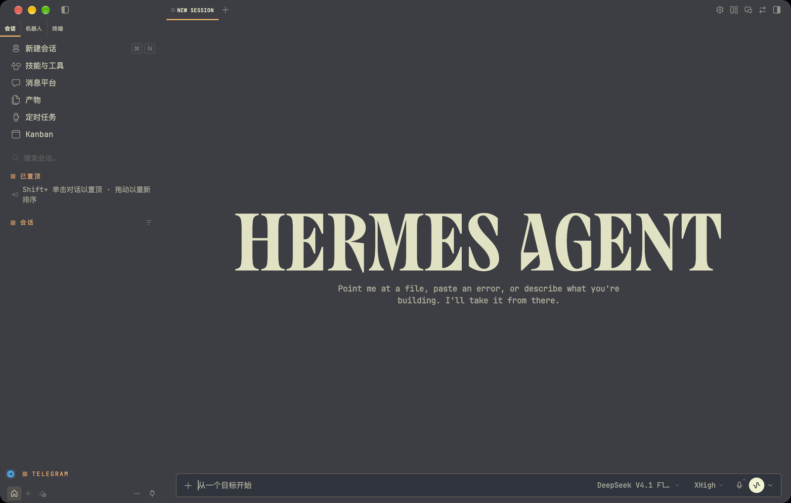

# 火山炭焰 Charizard — Hermes Desktop 桌面主题包



> 预览：`charizard-desk`（终端同款配色）+ App 自带原生磨砂玻璃，暗色外观，13px JetBrains Mono。
> 截图里的会话列表已做遮挡，不包含任何真实对话内容。

给 Hermes Desktop 用的**桌面专属**主题（不会改动 CLI/TUI 的 skin）。包含三套：

| 主题 | 说明 |
|---|---|
| `charizard-desk` 火山炭焰 | 终端同款观感：#282a33 底 + 奶油白 #FFFFD7 正文 + 琥珀橙 #FFAF5F，暖色气泡 |
| `graphite-soft` 石墨柔光 | 冷调深灰（GitHub Dark Dimmed 系），不刺眼、非纯黑 |
| `paper-soft` 奶白纸感 | 暖白纸底（Rosé Pine Dawn 系），非纯白 |

## 安装

### 方式一：从 Git 安装（推荐，桌面端自带）

1. 打开 Hermes Desktop → **插件页**（设置里的 Plugins / 插件）→「**从 Git 安装**」
2. 填仓库地址，例如：

   ```
   https://github.com/lawrence1912/charizard-desktop-theme
   ```

   （也支持 `owner/repo` 简写、`git@…` SSH 地址；想只装子目录可写 `…#子目录` 或 GitHub 的 `/tree/<分支>/<子目录>` 链接）
3. 勾选**桌面目标**（"安装到此应用的本地 desktop-plugins 文件夹"），确认安装。
4. 等几秒（App 会监听 `desktop-plugins/` 热加载）；没出来就在 ⌘K 里搜 **Reload desktop plugins**。

> 注意：安装后的文件夹名 = 仓库名，而插件 `id` 必须与文件夹名一致 ——
> 所以仓库名必须是 `charizard-desktop-theme`，或把文件里的 `id` 改成你的仓库名。

### 方式二：手动拷贝（离线/内网都行）

把这个文件夹整体放到：

```
$HERMES_HOME/desktop-plugins/charizard-desktop-theme/
└── plugin.js
```

- 默认 `$HERMES_HOME` 是 `~/.hermes`；**多配置（profile）用户注意**：要放进你要用的那个配置的目录，例如 `~/.hermes/profiles/<名字>/desktop-plugins/…`
- 文件夹名必须等于插件文件里的 `id`（`charizard-desktop-theme`），否则不会被加载
- 放好后 ⌘K → **Reload desktop plugins**，或重启 App

### 方式三：VS Code 主题转换（不装插件）

只想用配色、不想装插件的话，也可以把配色导出成 VS Code 主题 JSON，用 App 自带的
「安装主题…」导入（⌘K 或 设置 → 外观 → 搜索框）。注意这条路是单档配色、且不会带上
本包的"字体渲染增强"。

## 使用

- 设置 → 外观 → 主题（列表里会多出上面三套）
- 或 ⌘K 搜"主题" → 「主题：火山炭焰 Charizard」一键切换
- 主题按 profile 保存；只想删掉：设置 → 插件 里关掉，或删除该文件夹

## 两个可选开关（都在 plugin.js 里）

1. **字体渲染增强**：`TEXT_BOOST_CSS` 里的 `-webkit-text-stroke: 0.15px currentColor;`
   —— 让中文/拉丁笔画比 Chromium 默认略饱满一点（对应终端里的 `font-thicken`）。
   只对 `charizard-desk` 生效（选择器带 `html[data-hermes-theme^="charizard-desk"]` 前缀），
   换主题自动失效。不想要：删掉 `injectTextBoost()` 调用或把描边改成 `0`。
   想要更粗：0.3–0.45px 才有明显观感（0.45 约等于终端的厚字），≥0.7px 开始显糊。
2. **换配色**：只改 `colors` 里的值即可。注意桌面端会把 `background/card/popover/userBubble`
   先与近黑混合再渲染（暗色配方见文件顶部注释），所以想得到某个"最终颜色"需要按公式反推：
   `种子 = (目标 - 中性色 × (1-占比)) / 占比`。

## 说明

- 这是**桌面专属**插件：不写 `config.yaml`、不改 `display.skin`，CLI/TUI 的皮肤完全不受影响。
- 想连 CLI/TUI 一起换色，那是另一条路（`~/.hermes/skins/<name>.yaml` + `hermes config set display.skin <name>`）。
- 本包不含网络请求、不含任何存储写入（不会擅自改你的主题选择）。

## 想要磨砂玻璃（可选，不需要插件）

App 自带原生磨砂（macOS vibrancy）—— 设置 → 外观 → **窗口透明**：

| 选项 | 说明 |
|---|---|
| 模式 | **玻璃**（磨砂，文字保持清晰）/ 透明（整窗连文字一起透出） |
| 色调 | 0-100。0 = 完全保留主题底色；100 = 只剩裸玻璃。建议 30-50 |
| 磨砂质感 | 深邃（under-window）/ 柔和（popover）/ 明亮（titlebar）/ 透亮（header） |
| 应用范围 | 整个窗口 / 仅侧边栏（Finder 那种"侧栏玻璃、内容栏实底"，正文最稳） |

注意：范围选"整个窗口"时，如果背后是浅色窗口，奶油白正文的对比度会下降；
想永远保持正文可读性就选"仅侧边栏"。
