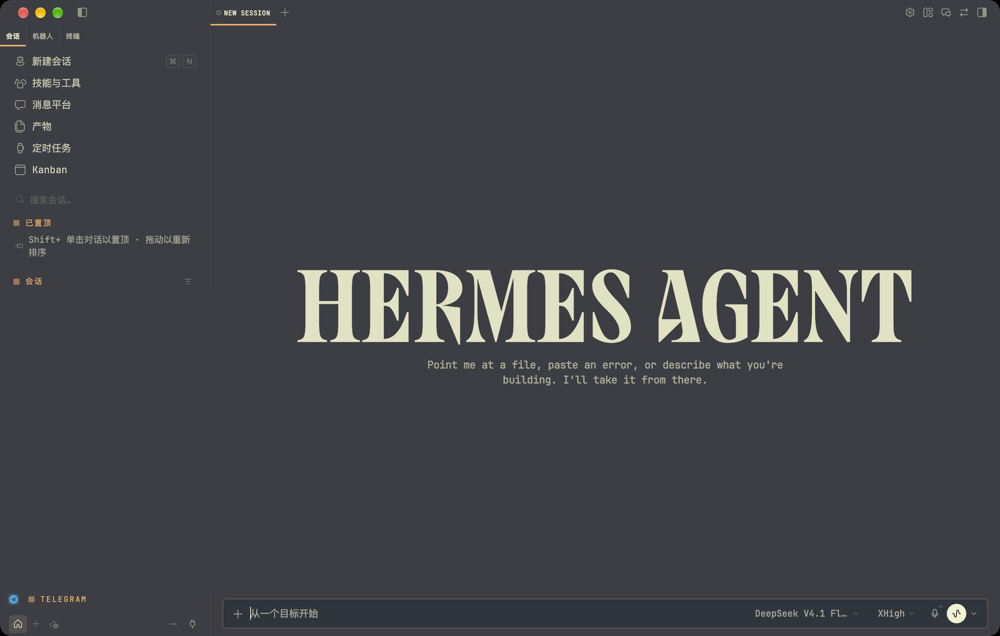

# 火山炭焰 Charizard — Hermes Desktop 桌面主题

> 终端同款配色 + 原生磨砂玻璃（截图里的会话列表已遮挡，不含真实对话）。
> 同一主题自带明暗两档：**浅色 = 暖纸昼**、**深色 = 火山炭焰**，随「外观」自动切换。

桌面专属主题：不写 `config.yaml`、不动 `display.skin`，CLI/TUI 完全不受影响。

## 安装

**方式一：从 Git 安装（推荐）**

1. Hermes Desktop → **插件页** → 「**从 Git 安装**」
2. 填仓库地址：`https://github.com/lawrence1912/charizard-desktop-theme`
3. 勾选**桌面目标**，确认，等几秒热加载

**方式二：手动拷贝**

把本文件夹整体放到 `~/.hermes/desktop-plugins/charizard-desktop-theme/`，
再在 ⌘K 里搜 **Reload desktop plugins**。

> 文件夹名必须等于插件 `id`（`charizard-desktop-theme`），否则不会加载。

## 使用

- 设置 → **外观 → 主题** → 选「火山炭焰 Charizard」，或在 ⌘K 里搜「主题：火山炭焰 Charizard」
- **明暗切换**：外观 → 浅色 / 深色 / 跟随系统（或直接按 **Shift+X** 一键互切）——
  浅色模式画「暖纸昼」，深色模式画「火山炭焰」，两档都是同一主题
- 不想要了：插件页里关掉，或删掉该文件夹

## 可选调整

- **字体渲染增强**（默认开）：见 `plugin.js` 的 `TEXT_BOOST_CSS`。桌面正文比终端笔画细一截，
  同色描边是终端 `font-thicken` 的 CSS 等价物（0.45px ≈ 1 物理像素，实测阶梯：
  无 16.8% → 0.25px 17.6% → 0.45px 19.5% → 0.7px 21.7%）。现役为 `0`（关闭）——
  描边叠上"界面文字同权"（把侧栏/设置的 500/600 字重压回 400）会偏重，两者取平衡；
  想要更接近终端的观感，把 `0px` 调到 `0.25–0.45px` 即可。
- **改配色**：改 `colors`（浅色档）/ `darkColors`（深色档）里的值。注意桌面端会先把表面色和
  中性色混一遍再渲染，想得到某个"最终颜色"要按公式反推（占比和公式见 `plugin.js` 顶部注释）。
- **磨砂玻璃**（App 自带，不用装东西）：设置 → 外观 → **窗口透明** ——
  模式 `玻璃`、色调 30–50、质感 `明亮`、范围 `整个窗口`（想保正文对比度就选 `仅侧边栏`）。
- 不想装插件：也可以把配色导出成 VS Code 主题 JSON，用 App 的「安装主题…」导入，
  但没有字体增强、也做不了同一主题的明暗双档。
